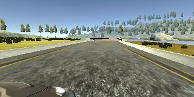

# Behaviorial Cloning Project

[](http://www.udacity.com/drive)

<a href="http://www.youtube.com/watch?feature=player_embedded&v=ExZuBu2sjSo
" target="_blank"></a> <a href="http://www.youtube.com/watch?feature=player_embedded&v=cMPceV6NytI
" target="_blank"></a>


## **Behavioral Cloning Project**

The goals / steps of this project are the following:

* Use the simulator to collect data of good driving behavior 
* Build, a convolution neural network in Keras that predicts steering angles from images
* Train and validate the model with a training and validation set
* Test that the model successfully drives around track one without leaving the road


[//]: # (Image References)

[image1]: ./examples/T1_First_training_no_dropout.png "Training with out dropout layer" 
[image2]: ./examples/T1_First_training.png "Training with dropout layer"
[image3]: ./examples/placeholder_small.png "Recovery Image"
[image4]: ./examples/placeholder_small.png "Recovery Image"
[image5]: ./examples/placeholder_small.png "Recovery Image"
[image6]: ./examples/placeholder_small.png "Normal Image"
[image7]: ./examples/placeholder_small.png "Flipped Image"


## **Files Submitted**

My project includes the following files:

* model.py:   containing the script to create and train the model
* drive.py:   for driving the car in autonomous mode using the Udacity simulator [(link)](https://github.com/udacity/self-driving-car-sim)
* model.h5:   containing a trained convolution neural network for the lake track
* model2.h5:  containing a trained convolution neural network for the mountain track
* video.mp4: video of the autonomous drive in the lake track
* video2.mp4: video of the autonomous drive in the mountain track


## **Scripts usage**

For use the trained model in the Udacity simulator
```
python drive.py model.h5
```

For trained the network
```bash
usage: model.py [-h] [-d DATA_DIR] [-sf MODEL_SAVE_FILE] [-e EPOCHS]
                [-ft FINE_TUNING] [-lf MODEL_LOAD_FILE]

Behavioral Cloning P3

optional arguments:
  -h, --help            show this help message and exit
  -d DATA_DIR, --data_dir DATA_DIR
                        train data directory
  -sf MODEL_SAVE_FILE, --model_save_file MODEL_SAVE_FILE
                        file to save the model
  -e EPOCHS, --epochs EPOCHS
                        epochs number
  -ft FINE_TUNING, --fine_tuning FINE_TUNING
                        fine tuning option
  -lf MODEL_LOAD_FILE, --model_load_file MODEL_LOAD_FILE
                        file to load the base model
```
Train a network for the first time and save the trained model

```bash
  python model.py -d ./data -sf model.h5
```

Trasnfer learning: Use a trained network, fine tune with a new data set and save the new trained model.

```bash
 python model.py -d ./data_new -sf model.h5 -ft True -lf model_new.h5
```

  
## **Model**

The model.py file contains the code for training and saving the convolution neural network. The file shows the pipeline I used for training and validating the model, and it contains comments to explain how the code works.

### Model Architecture and Training Strategy

#### 1. Architecture

The model is the [NVIDIA CNN network](https://devblogs.nvidia.com/parallelforall/deep-learning-self-driving-cars/):


| Layer (type)                 |Output Shape            | Param #  |            Note  |
|------------------------------|:---------------------:|:---------:|:---------------------------------------------------------------------|        
| input_1 (InputLayer)         |(None, 160, 320, 3)    |   0       |  The input of the network are RGB images of (160 x 320).             |
| lambda_1 (Lambda)            |(None, 160, 320, 3)    |   0       |  Normalization layer with lambda x: x / 127.5 - 1                    |
| cropping2d_1 (Cropping2D)    |(None, 90, 320, 3)     |   0       |  Crop images: top crop = 50 pxl and bottom crop = 20 pxl   
| conv2d_1 (Conv2D)            |(None, 43, 158, 24)    |   1824    || 
| conv2d_2 (Conv2D)            |(None, 20, 77, 36)     |   21636   ||  
| conv2d_3 (Conv2D)            |(None, 8, 37, 48)      |   43248   ||  
| conv2d_4 (Conv2D)            |(None, 6, 35, 64)      |   27712   || 
| conv2d_5 (Conv2D)            |(None, 4, 33, 64)      |   36928   || 
| dropout_1 (Dropout)          |(None, 4, 33, 64)      |   0       | Dropout layer with rate= 0.5             |  
| flatten_1 (Flatten)          |(None, 8448)           |   0       ||  
| dense_1 (Dense)              |(None, 100)            |   844900  ||  
| dense_2 (Dense)              |(None, 50)             |   5050    ||  
| dense_3 (Dense)              |(None, 10)             |   510     ||  
| dense_4 (Dense)              |(None, 1)              |   11      |   The labels are the steering angle. |


The activation function for all the layer is a [Relu](https://en.wikipedia.org/wiki/Rectifier_(neural_networks)).

#### 2. Attempts to reduce overfitting in the model

The model contains dropout layers in order to reduce overfitting. 

The model was trained and validated on different data sets to ensure that the model was not overfitting. The model was tested by running it through the simulator and ensuring that the vehicle could stay on the track.

| Without dropout | With dropout |
| - | - | 
| |  |


#### 3. Model parameter tuning

The model used an adam optimizer, so the learning rate was not tuned manually.

#### 4. Appropriate training data

Training data was chosen to keep the vehicle driving in the center of the road for 3 to 4 laps. Smaller data sets produce poor results.

##### 4.1 Data augmentation

During the training phase 3 images were capture corresponding to a center camera, a left camera and right camera. 
In order to have more data to train the model, the 3 images were used. The new labels to the left and right images were calculated from the steering angle of the center camera by applying a correction factor.

|Image right (angle = 0.57 - 0.2) | Image center (angle = 0.57) | Image left (angle 0.57 + 0.2)|
|- | - | - |
||  | |

Other transformatin apply was to crop the image to train the network only with more relevant information. By cropping the image the front of the car and the sky is removed.

|Original | Crop |
| - | - |
||  |

#### 5. Transfer learning

In model.py there is the option to use transfer learning using fine tuning. This option load a trained model remove the last layer and replace it with a new one initialized with random values.

This option was used to retrained the model with a new data set without lossing all the information of the previous training sessions. In particular the option used with the same data produces a more accurate result. 

An example of the training process is as follow:

Train for the first time:

```bash
  python model.py -d ./data -sf model.h5
```
Retrained the model using the same data:

```bash
 python model.py -d ./data -sf model.h5 -ft True -lf model.h5
```
Retrained the model using the new data:

```bash
 python model.py -d ./data_new -sf model.h5 -ft True -lf model.h5
```
The inital data was the one provided by Udacity in [link](https://d17h27t6h515a5.cloudfront.net/topher/2016/December/584f6edd_data/data.zip). The new data was created using the simulator in the training mode for 3 laps driving in the opposite sense. The biggest improvement in using the new data is that the car in the sharpest curves is more center.

|First training | Final training|
|- | -| 
| |  |

Note that the new data should be big enough to not loss model acuracy. Using small data to retrined the model makes the model to overfit.

This is an example of retrained the model for the montain track with a small data set.


## **Results**

* Lake track: [youtube video](http://www.youtube.com/watch?feature=player_embedded&v=ExZuBu2sjSo)
* Montain track: [youtube video](http://www.youtube.com/watch?feature=player_embedded&v=cMPceV6NytI)

## **Results**

* The NVIDIA mode is really powerful nd acure for this kind of predictions. It shows a really good results without making too much effort in the image preprocessing or data augementation.
* Using Keras library instead of tensorflow makes the implementation phase much faster, clear and with less bugs.

## **TODO**
* Generate one model capable of drive both tracks.


